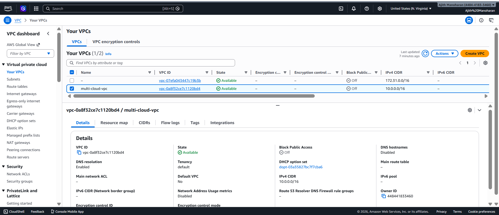
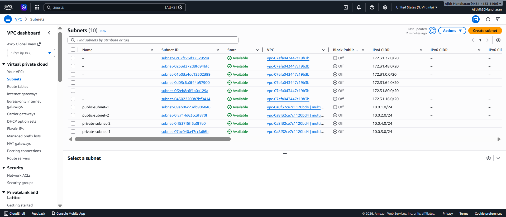
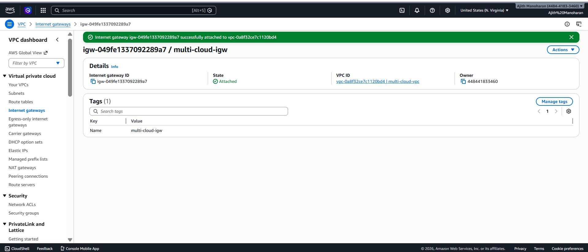
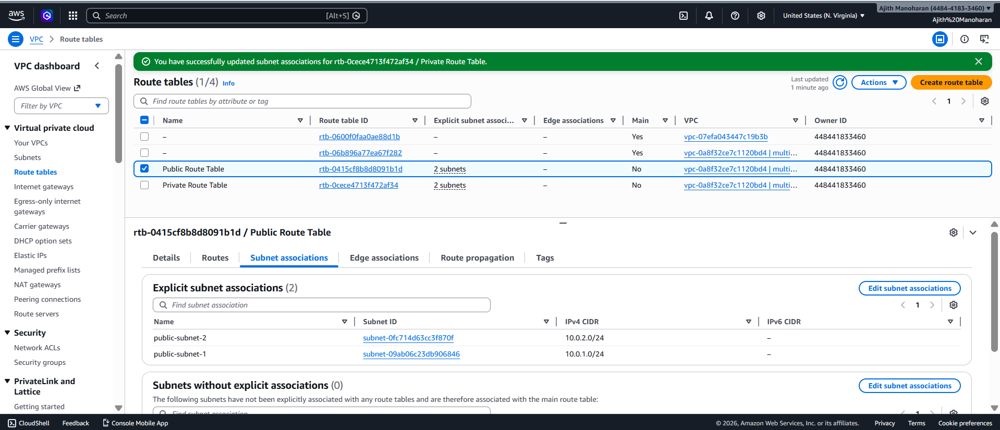
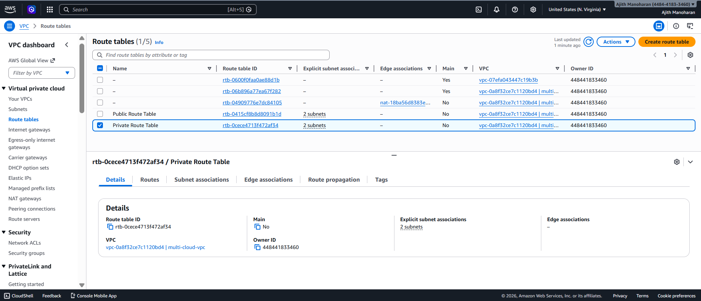

# AWS Network Architecture

This section covers the foundational AWS networking setup for the multi-cloud high availability architecture.

## Architecture Components

- Custom VPC (10.0.0.0/16)
- Public and Private Subnets
- Internet Gateway
- NAT Gateway
- Route Tables
- Security Groups

---

## 1️⃣ VPC Overview

---

## 2️⃣ Public & Private Subnets

---

## 3️⃣ Internet Gateway Attached

---

## 4️⃣ NAT Gateway

---

## 5️⃣ Public Route Table

---

## 6️⃣ Private Route Table

---

## 7️⃣ Security Groups Configuration

---

### Outcome

AWS network is fully segmented with public-facing ALB and private compute layer.
