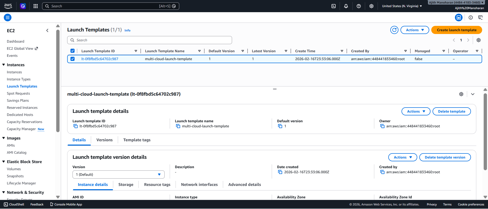
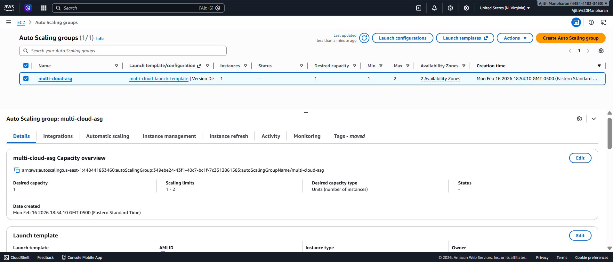
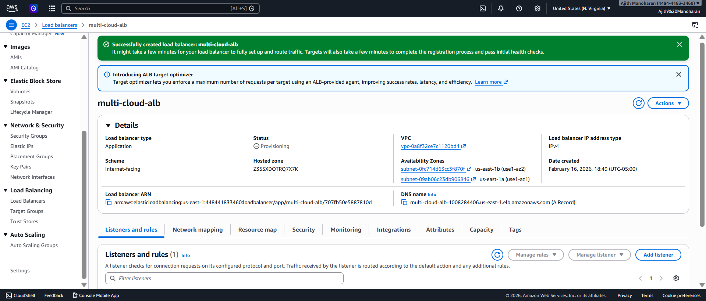
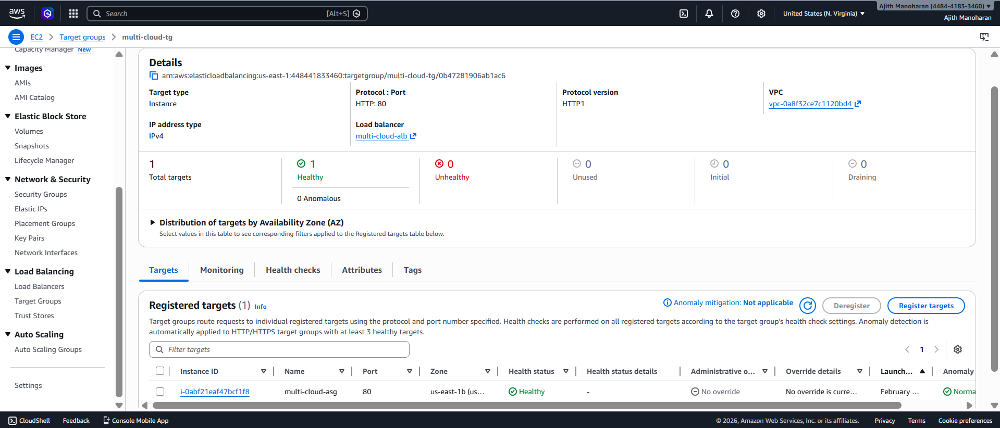
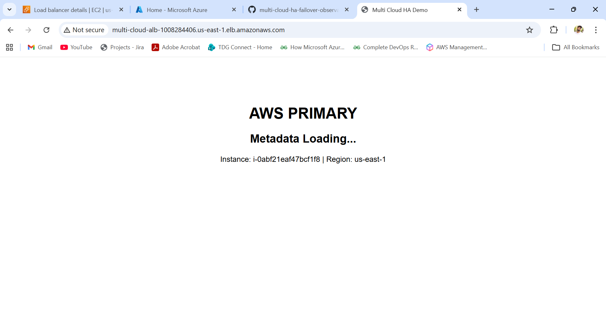

# AWS Compute & Application Load Balancer

This section demonstrates the primary active deployment in AWS.

---

## Launch Template

---

## Auto Scaling Group

---

## Application Load Balancer

---

## Target Group Healthy

---

## AWS Primary Page Loaded

---

### Outcome

AWS operates as the primary active region behind ALB with auto-scaling enabled.
