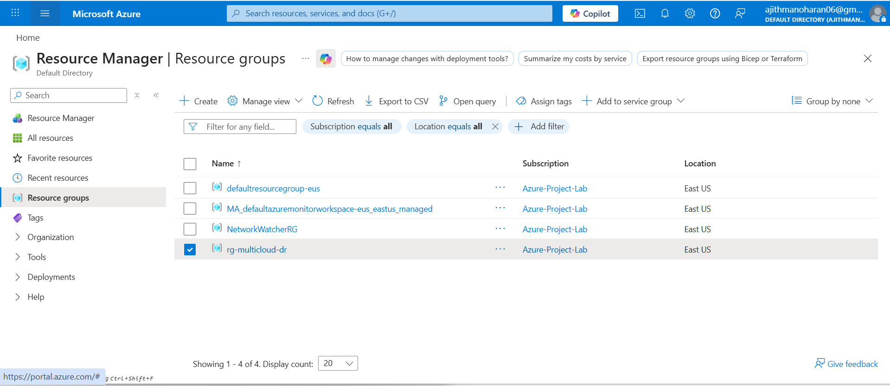
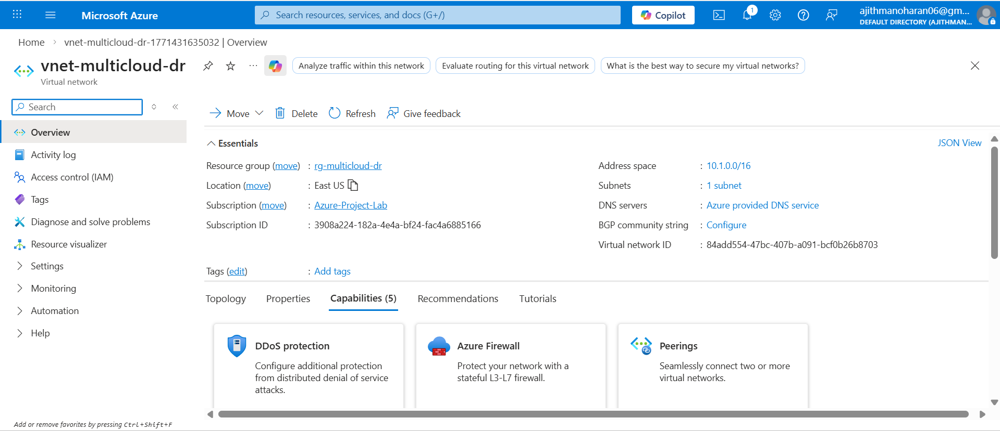
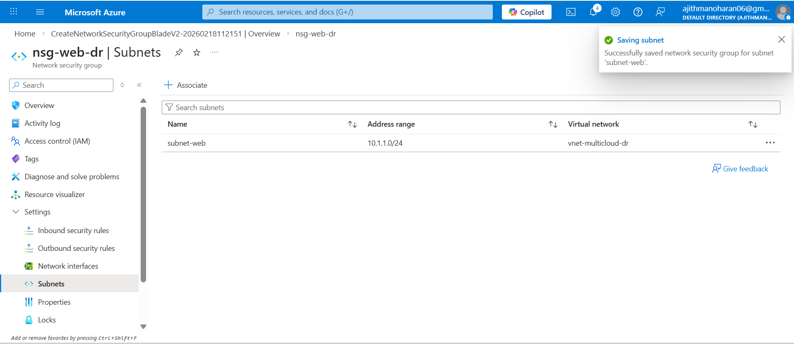
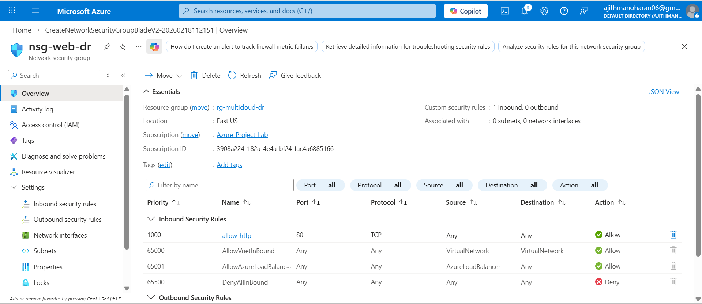
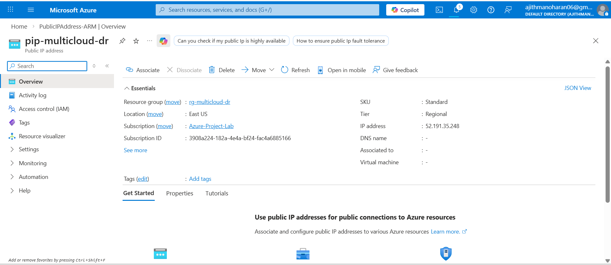

# Azure Network Configuration (Disaster Recovery)

Azure acts as the secondary DR region.

---

## Resource Group

---

## Virtual Network

---

## Subnet Configuration

---

## Network Security Group Rule

---

## Public IP (Standard SKU)

---

### Outcome

Azure network prepared for load-balanced DR deployment.
