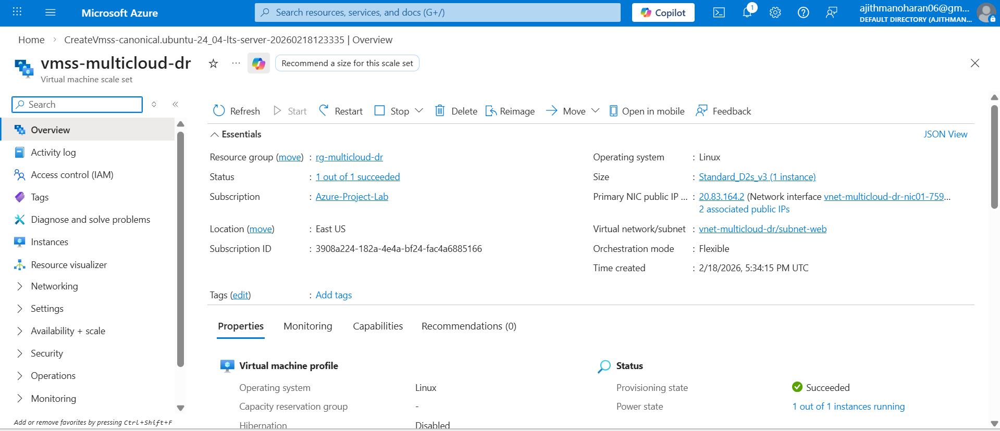
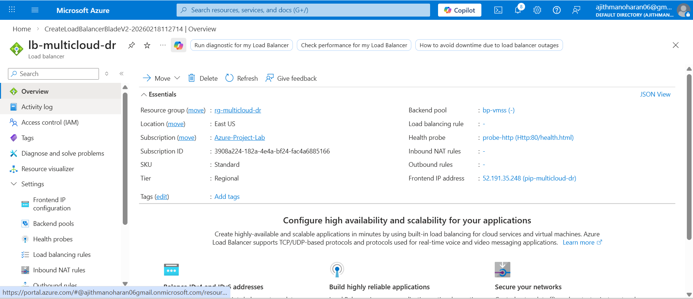
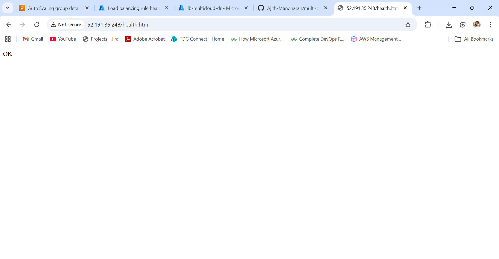

# Azure VMSS & Load Balancer

Azure VM Scale Set configured behind Standard Load Balancer.

---

## VM Scale Set Overview

---

## Load Balancer Overview

---

## Load Balancing Rule

---

## Azure DR Page Loaded

---

## Azure DR Health Endpoint Page 

---

### Outcome

Azure DR region fully operational and ready for DNS failover.
