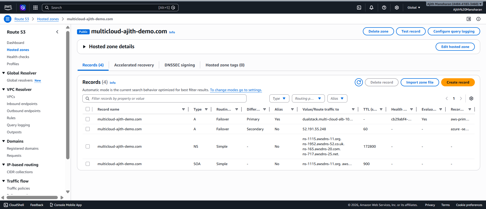
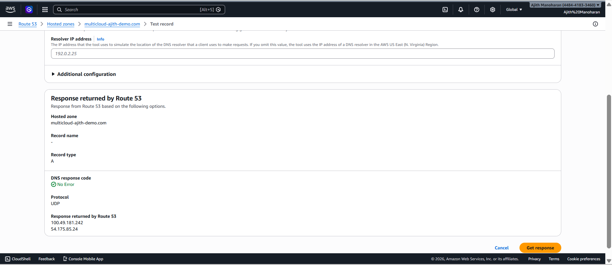
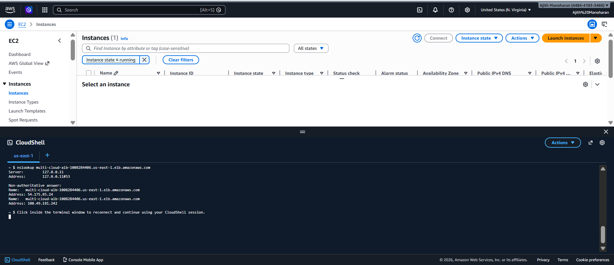
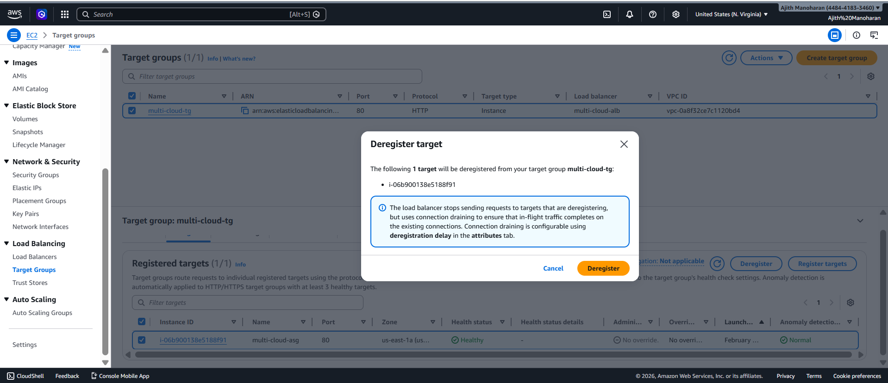
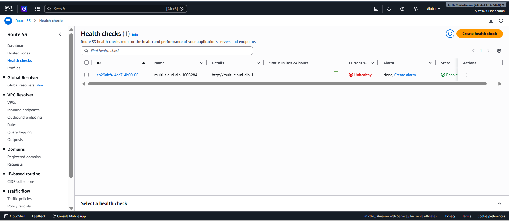
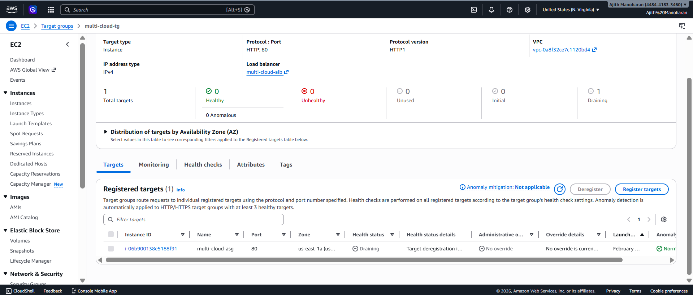
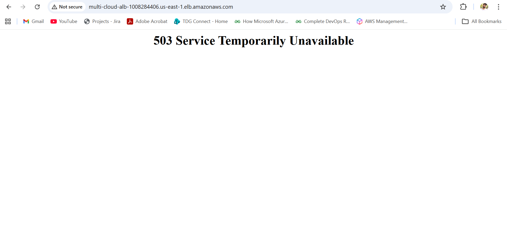
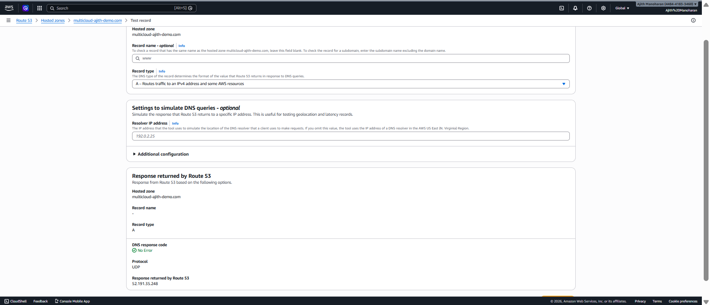
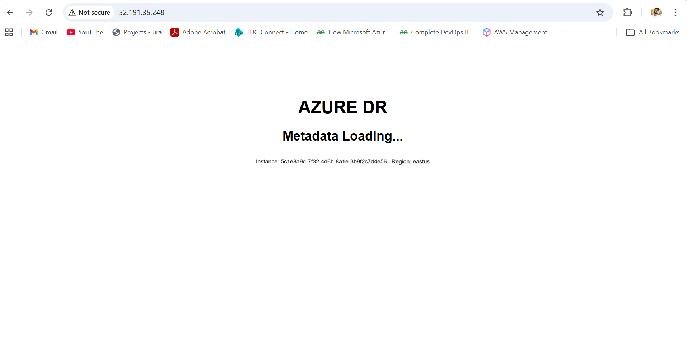

# Failover Simulation

This section demonstrates real-time failover testing.

---

## Hosted Zone Created

---

## DNS Test – Primary Response

---

## nslookup Validation

---

## Deregister AWS Target

---

## Route 53 Health Detected Unhealthy

---

## Target Draining

---

## AWS Site Down (503 Error)

---

## DNS Switched to Azure

---

## Azure DR Page Loaded

---

### Outcome

Automatic DNS-based failover successfully redirected traffic from AWS (Primary) to Azure (Secondary DR) without manual intervention.

